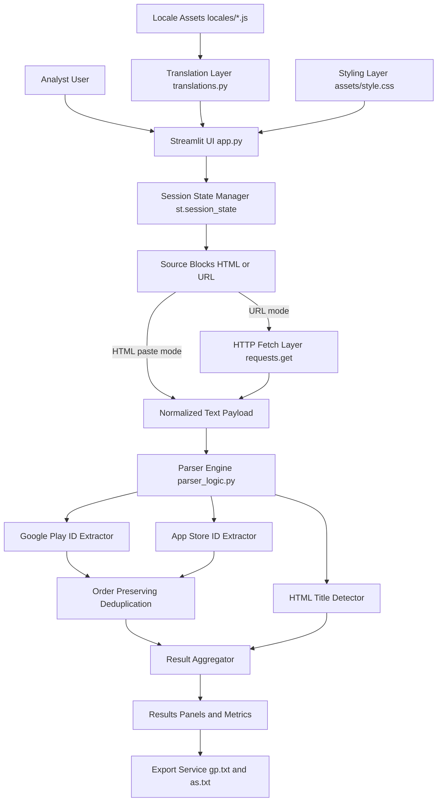

## System Architecture Diagram

This diagram explains how the Streamlit interface, parsing engine, localization layer, and export workflow cooperate to transform raw HTML or fetched URL content into deduplicated app identifiers for analyst-friendly output.

### Structural Breakdown

#### Entities / Nodes

1. **Analyst User (`U`)**  
   The operator who provides data sources, starts parsing, reviews extracted IDs, and downloads outputs. This actor drives the full lifecycle from input collection to result export.

2. **Streamlit UI (`UI`, `app.py`)**  
   The application entrypoint and orchestration layer. It renders controls, gathers source inputs, coordinates parser calls, displays results, and exposes export actions.

3. **Session State Manager (`SS`, `st.session_state`)**  
   Maintains persistent UI state across Streamlit reruns, especially dynamic multi-source blocks and current interaction context.

4. **Source Blocks (`SRC`)**  
   Logical containers for each source item. Each block can hold either pasted raw HTML content or a URL that must be fetched first.

5. **HTTP Fetch Layer (`NET`, `requests.get`)**  
   Retrieves remote page content when a source block is configured in URL mode. It feeds fetched response content into normalized parser input.

6. **Normalized Text Payload (`RAW`)**  
   Unified text representation consumed by parser logic. It abstracts whether content originated from direct paste mode or network fetch mode.

7. **Parser Engine (`PARSER`, `parser_logic.py`)**  
   Central extraction coordinator containing regex-based logic. It delegates to specialized extractors for Android package names, iOS App Store IDs, and optional title inspection.

8. **Google Play ID Extractor (`GP`)**  
   Extracts package identifiers from Google Play URL patterns (for example, `com.example.app`).

9. **App Store ID Extractor (`AS`)**  
   Extracts numeric Apple App Store identifiers from Apple/iTunes URL forms (for example, `id123456789`).

10. **HTML Title Detector (`TITLE`)**  
    Pulls page title metadata (when available) to improve interpretability and analysis context around extracted identifiers.

11. **Order Preserving Deduplication (`DEDUP`)**  
    Removes repeated IDs while preserving first-seen order. This keeps output concise while retaining practical source-order signal.

12. **Result Aggregator (`RES`)**  
    Combines deduplicated IDs and optional contextual metadata into a unified result object suitable for UI rendering and download generation.

13. **Results Panels and Metrics (`VIEW`)**  
    Presentation layer for counts, extracted identifier lists, and user feedback sections in the Streamlit UI.

14. **Export Service (`EXP`)**  
    Converts final results to downloadable plaintext artifacts, typically `gp.txt` for Google Play IDs and `as.txt` for App Store IDs.

15. **Translation Layer (`I18N`, `translations.py`)**  
    Supplies localized strings to the UI so labels, actions, and system messages are language-aware.

16. **Locale Assets (`LOC`, `locales/*.js`)**  
    Externalized language-specific modules that support localization consistency and future integration workflows.

17. **Styling Layer (`CSS`, `assets/style.css`)**  
    Defines visual styling and interface presentation details for the Streamlit app.

#### Relationships / Connections

- **`U --> UI`**: The user interacts directly with the app interface to input sources and execute parsing.
- **`UI --> SS`**: The UI writes and reads interaction state so multi-source workflows persist between rerenders.
- **`SS --> SRC`**: Session state tracks source blocks and their current mode/content.
- **`SRC --> NET` (URL mode)**: When a source is configured as a URL, content flows through HTTP retrieval.
- **`SRC --> RAW` (HTML paste mode)**: Directly pasted HTML bypasses network fetch and becomes parser input immediately.
- **`NET --> RAW`**: Fetched response text is normalized into the same raw payload channel used by paste mode.
- **`RAW --> PARSER`**: Unified input enters extraction logic, ensuring one parser path regardless of source type.
- **`PARSER --> GP` and `PARSER --> AS`**: The parser engine delegates platform-specific extraction responsibilities to dedicated logic paths.
- **`PARSER --> TITLE`**: Title extraction runs as an additional context-enrichment branch.
- **`GP --> DEDUP` and `AS --> DEDUP`**: Both platform result streams pass through deduplication to eliminate repeats while preserving encounter order.
- **`DEDUP --> RES`**: Clean identifier sets flow into the aggregator.
- **`TITLE --> RES`**: Context metadata joins extracted IDs in the final structured result.
- **`RES --> VIEW`**: Aggregated results are rendered into visual output panels and metrics.
- **`VIEW --> EXP`**: Data already prepared for display is transformed into downloadable text files.
- **`LOC --> I18N --> UI`**: Locale assets feed translation mappings, which the UI consumes to present multilingual text.
- **`CSS --> UI`**: Styling rules are applied to the rendered interface components.

#### Control Flow / Logic

1. The user opens the app and selects language and source configuration in the Streamlit UI.
2. Source definitions are persisted in session state so the interface can rerun safely without losing user-entered data.
3. For each source block, the system branches:
   - URL mode: fetch remote content through `requests`.
   - HTML mode: use pasted content directly.
4. Both branches converge into a normalized raw text payload pipeline.
5. Parser logic processes each payload with regex-based extraction for Google Play package names and App Store numeric IDs, and optionally captures title data.
6. Extracted identifiers are deduplicated in first-seen order to preserve analyst-relevant ordering.
7. Aggregated results are displayed as counts and lists in output panels.
8. The user exports final datasets into `gp.txt` and `as.txt` for downstream operations.

This design is efficient because it centralizes parsing behind a unified input channel, separates UI orchestration from parser logic, and preserves deterministic output behavior across multi-source runs.

### Use Cases / Scenario Examples

1. **Mixed-source batch run**  
   An analyst adds three sources (two URLs and one pasted HTML dump). The system fetches URL content, merges all payloads through the same parsing flow, deduplicates IDs globally, and returns one clean combined output set.

2. **Localization-first operation**  
   A non-English operator switches to a translated UI language. The translation layer updates labels and action text while parsing behavior remains unchanged.

3. **Duplicate-heavy discovery pages**  
   Input pages contain repeated app links due to recommendation blocks. Deduplication removes duplicates while preserving first-seen order, keeping exported files compact and predictable.
